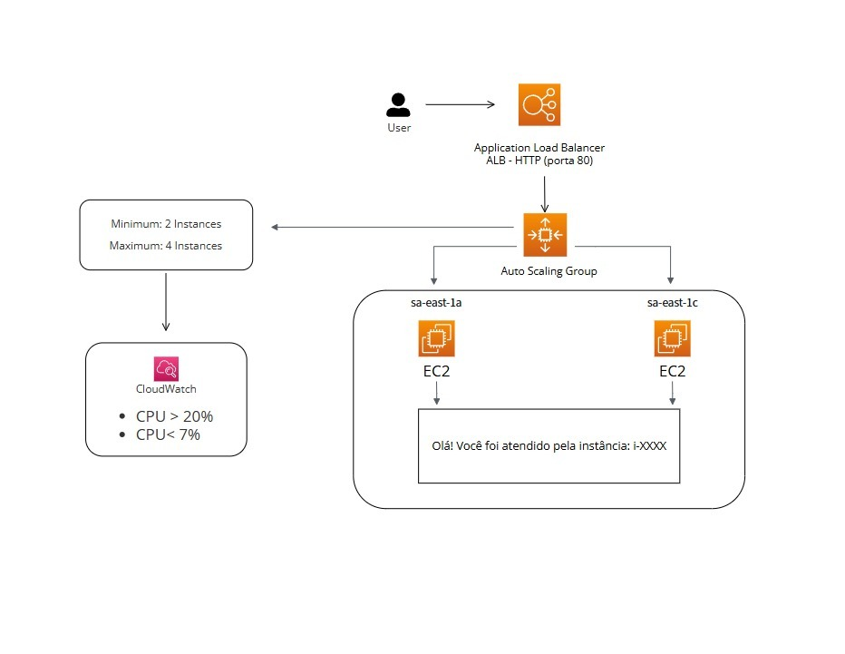

# 📘 Projeto: Infraestrutura Escalável com Auto Scaling e Load Balancer na AWS

## 🧩 Contexto do Desafio

Imagine o seguinte cenário: uma startup em rápido crescimento está prestes a lançar uma campanha de marketing que pode gerar um alto volume de tráfego repentino em seu site. A aplicação, uma simples página HTML de boas-vindas, precisa estar sempre disponível, mesmo sob carga. É aí que entra o objetivo — desenhar e implementar uma infraestrutura **escalável, tolerante a falhas e com recuperação automática**.

A missão era clara: **provisionar e automatizar a entrega de uma aplicação estática, utilizando EC2, Auto Scaling Group e Application Load Balaancer, com escalabilidade baseada em métricas de CPU via CloudWatch**.

---

## 🧠 Lógica da Arquitetura e Funcionamento Dinâmico

O diagrama a seguir representa a visão lógica da infraestrutura, destacando como os componentes interagem para garantir escalabilidade automática, alta disponibilidade e tolerância a falhas:



**Funcionamento detalhado:**

* 🧭 O usuário acessa a aplicação via o DNS público do Application Load Balancer (ALB), que escuta na porta 80 e distribui o tráfego entre instâncias EC2 saudáveis por meio de um target group.
* 📊 O ALB realiza health checks constantes nas instâncias, garantindo que apenas instâncias operacionais recebam tráfego.
* ⚙️ O Auto Scaling Group (ASG), integrado ao ALB, gerencia automaticamente o número de instâncias com base em políticas definidas no Amazon CloudWatch.
* 🧱 As instâncias EC2 são baseadas em uma AMI personalizada, pré-configurada com Apache e uma página HTML que exibe dinamicamente a ID da instância. Isso permite verificar visualmente a rotação de requisições entre as instâncias.
* 🧮 As regras de escalonamento estão configuradas da seguinte forma:

  * Se o uso de CPU for igual ou superior a 20%, o ASG adiciona 2 novas instâncias (até o limite de 4).
  * Se o uso de CPU cair para 7% ou menos, o ASG reduz o número de instâncias em 2 (respeitando o mínimo de 2).
* 🌐 Toda a infraestrutura está distribuída entre duas zonas de disponibilidade (sa-east-1a e sa-east-1c), garantindo resiliência mesmo em caso de falha regional.

Essa estrutura assegura que a aplicação se adapte automaticamente à demanda, mantendo o equilíbrio entre custo e desempenho — pilares da computação em nuvem moderna.

## 🧱 Arquitetura Alvo

A estrutura desejada envolvia os seguintes componentes:

- **Instância EC2 com Apache ou Nginx e página HTML personalizada**
- **Criação de uma imagem personalizada (AMI)**
- **Launch Template para Auto Scaling**
- **Auto Scaling Group (ASG)** integrado com **Application Load Balancer (ALB)**
- **Políticas de escalabilidade com base em uso de CPU**
- **Simulação de carga com JMeter para validação da escalabilidade**

---

## 📍 Etapas do Projeto

### 1️⃣ Criação da Instância EC2 Base

A jornada começou com a criação de uma instância EC2 simples, que serviria como **base da imagem personalizada**.

**Configurações iniciais:**

<br>

- Tipo: `t2.micro` (elegível ao Free Tier)
- Sistema Operacional: **Ubuntu Server 22.04**
- Grupo de Segurança: **porta 80 liberada**
---
- IMDSv2: configurado como “**optional**” para permitir uso de metadados via `curl`


<br>


---

**Instalação e configuração do Apache:**
```bash
sudo apt update
sudo apt install -y apache2
sudo systemctl start apache2
sudo systemctl enable apache2
```

**Verificação do serviço:**
```bash
sudo systemctl status apache2
```

**Criação da página HTML dinâmica:**
```bash
sudo bash -c "cat > /var/www/html/index.html" <<EOF
<!DOCTYPE html>
<html>
<head>
  <title>Boas-vindas</title>
</head>
<body>
  <h1>Olá! Você foi atendido pela instância: $(curl -s http://169.254.169.254/latest/meta-data/instance-id)</h1>
</body>
</html>
EOF
```

Essa instância serviu como base para todos os nós futuros do Auto Scaling Group.

---

### 2️⃣ Criação da AMI (Amazon Machine Image)

Após configurar a instância com Apache e a página HTML personalizada, o próximo passo foi criar uma **imagem personalizada (AMI)**. Essa imagem captura todos os pacotes instalados, configurações e arquivos criados, garantindo **rapidez e padronização no provisionamento automático** das instâncias futuras.


---

### 3️⃣ Criação do Launch Template (Modelo de Execução)

Com a AMI criada, desenvolvemos um **Launch Template** com os seguintes parâmetros:

- AMI: personalizada com Apache e HTML
- Tipo: `t2.micro`
- Rede: configurada para VPC pública e compatível com ALB


<br>


- User Data (script de inicialização):

```bash
#!/bin/bash

INSTANCE_ID=$(curl -s http://169.254.169.254/latest/meta-data/instance-id)

sudo bash -c "echo '<!DOCTYPE html>' > /var/www/html/index.html"
sudo bash -c "echo '<html>' >> /var/www/html/index.html"
sudo bash -c "echo '<head><title>Boas-vindas</title></head>' >> /var/www/html/index.html"
sudo bash -c "echo '<body>' >> /var/www/html/index.html"
sudo bash -c "echo '<h1>Olá! Você foi atendido pela instância: $INSTANCE_ID</h1>' >> /var/www/html/index.html"
sudo bash -c "echo '</body>' >> /var/www/html/index.html"
sudo bash -c "echo '</html>' >> /var/www/html/index.html"

```

Esse script garante que, mesmo que a instância seja criada por Auto Scaling, ela ainda personalize sua resposta.


---

### 4️⃣ Configuração do Application Load Balancer (ALB)

O **Application Load Balancer (ALB)** foi configurado para distribuir o tráfego entre múltiplas zonas de disponibilidade e suportar alta disponibilidade.

- Tipo: Application


- Protocolo: HTTP
- Porta: 80
- Grupo de destino: instâncias do Auto Scaling Group


- Health checks ativados: `/` na porta 80


O ALB foi associado ao grupo de destino criado e configurado com **duas zonas de disponibilidade**, permitindo alta resiliência mesmo em falhas regionais.


---

### 5️⃣ Criação do Auto Scaling Group (ASG)

Com o modelo de execução pronto e o ALB configurado, criamos o **Auto Scaling Group (ASG)** com as seguintes definições:

- Nome: `webapp-asg`
- Zonas de disponibilidade: 2
- Load Balancer: integrado ao ALB
- Health Checks: ativados
- Tempo de aquecimento: 300 segundos
- Substituição automática de instâncias com falha
- Capacidade:
  - Mínima: 2
  - Máxima: 4
  - Desejada: 2


---

### 6️⃣ Definição de Políticas de Escalabilidade com CloudWatch

Inicialmente, as políticas foram configuradas para escalar apenas sob **altos níveis de CPU (50%)**, mas, durante os testes, percebeu-se que era difícil atingir esse limiar com uma aplicação tão leve. Por isso, ajustes foram feitos:

**Políticas finais:**
- 📈 Escalar para cima: se CPU ≥ 20% → adicionar 2 instâncias


<br>


- 📉 Escalar para baixo: se CPU ≤ 7% → remover 2 instâncias


<br>


**Métricas monitoradas:**
- `EC2 > CPUUtilization`
- Alarmes configurados no CloudWatch, associados ao ASG


---

### 7️⃣ Testes de Carga com Apache JMeter

Para simular um cenário real de tráfego elevado, foi utilizado o **Apache JMeter** com a seguinte configuração:

- **Thread Group:** 1000 usuários virtuais em 60 segundos
- **Método HTTP:** GET


- **Endpoint:** URL pública do ALB


- **Objetivo:** disparar escalonamento vertical automático


---

## 🧠 Lições Aprendidas

### ✅ Aprendizados Técnicos
- Interconexão prática entre EC2, AMI, Launch Templates, ASG, ALB e CloudWatch
- Criação de AMIs reutilizáveis com configuração prévia de ambiente
- Configuração detalhada de health checks e tempo de aquecimento
- Ajuste fino de políticas de escalabilidade com base em observações reais
- Validação de arquitetura com simulações de carga (JMeter)

### ⚠️ Desafios Enfrentados
- Dificuldade de atingir 50% de uso de CPU em aplicações leves
- Necessidade de flexibilizar a configuração do IMDSv2 para permitir uso de `curl`
- Integração dos componentes (ASG + ALB) exigiu atenção especial aos health checks
- Compreensão e ajuste do tempo de aquecimento, crucial para evitar escalonamento prematuro

---

## 🌍 Resultado Final

O sistema final é uma infraestrutura escalável e tolerante a falhas, capaz de responder de forma automática ao aumento (ou redução) de tráfego, utilizando o melhor da **arquitetura elástica da AWS**.

 **Quando o Jmeter Ativo:**
Simulando que tem um alto trafego na aplicação.
**Resultando:**
<br>
 
 
 
 

<br>
<br>
<br>
<br>

 **Quando o Jmeter Desligado:**
 Simulando que tem um baixo trafego na aplicação.
**Resultando:**

<br>
 
 
 
 
 
<br>
<br>
<br>
<br>


### 🔗 Link da Aplicação
`https://webapp-lbc-2061089251.sa-east-1.elb.amazonaws.com`

